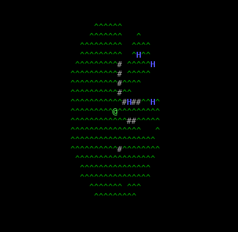

# Alone: the roguelite

Simple single-player ANSI roguelite. It's intended as a toy project to learn a bit about single-player game programming
(and also specifically to learn artemis-odb) without the hassle of game physics and most importantly graphics.

It deviates a bit from the "roguelite canon" already at this early stage: the creatures and objects are permanent.
A basic reproductive ability and genetic modification should allow for an increasingly difficult environment,
adapting to itself and to the player growing in strength.

**NB: this is not even in alpha state.** Lurk freely if you like the concept, but *know* this is not playable, by far. Keep an eye on the [releases](https://github.com/fabioticconi/alone-the-roguelite/releases) area, for the future.

# Features

Not all the following is completely implemented, but you can see as a "core feature". It will be in.

## Field of view

Thanks to [rlforj](https://github.com/kba/rlforj), we are now using "precise permissive FOV", providing with a nice shadowing/light casting.

Creatures and player alike have, thus, only a limited view of the world and can hide from indiscreet eyes.

## Persistence

Creatures don't "pop", they don't appear when needed, but the simulation keeps going even when the player is not looking. The world evolves around you.
