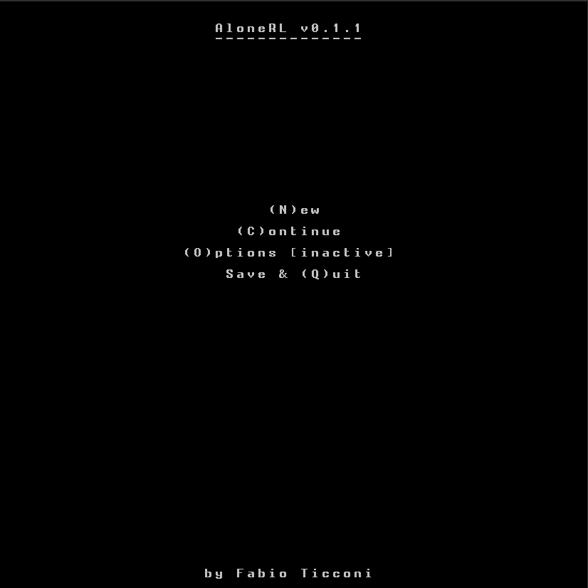

# Alone

Single-player ASCII roguelike focused on surviving, alone, on an island inhabited by animals.
The main inspiration is from [Unreal World](http://unrealworld.fi) and [Wayward](http://www.waywardgame.com),
with a much simpler gameplay.

It's a real-time game but it defaults to a turn-based modality where the world only advances during player actions,
for as long as the player action runs. Pure real-time gameplay can be toggled.

**NB: this is not ready yet.** Keep an eye on the [releases page](https://github.com/fabioticconi/alone-the-roguelite/releases)
for a stable release.

## Controls

* **`directional arrows` to move** (hold two together for diagonal movement, eg UP+RIGHT to go north-east)

  Move into creatures to attack them, trees to cut them, boulders to crush them.
  For the last two you need proper tools (a cutting weapon for cutting three and a blunt weapon
  for crushing boulders).
  
* **`g` to get an item**. You must move onto it first. There is no inventory limit.

* **`d` to open the Drop screen**. You will be able to choose which item to drop.

* **`e` to open the Eat screen**. You can only eat corpses that you have taken from the ground, for now.

* **`w` to wear or wield an object** via the Equip screen. Stones and branches will do nicely for now.

* **`l` to open the Look screen**. Move around to choose a target (if you have Line of Sight) and press **`t`** to throw
  an equipped weapon in that direction.
  
* **`c` to open the Craft screen**. A list of recipes is loaded anew from a yaml file and displayed. See
  [Crafting](https://github.com/fabioticconi/alone-rl#crafting) for details.

There are also some special commands:

* **`Ctrl+SPACE`** to toggle real-time/turn-based behaviour

* **`SPACE`** to pause/unpause if you are on real-time mode; if you are on turn-based mode, keep `SPACE`
  pressed to temporarily run the game in real-time (needed, for example, to recover stamina when you finish it,
  or regenerate health).

* **`F1`** removes the speed delay of the player. Useful to test the game without having to suffer the movement delays.
  Will be removed in the final version.

* **`F2`** restores the correct player speed.
  Will be removed in the final version.

## Screenshots

This is how the game looks when run:

### Map

After selecting a new game you have to generate the world, just before choosing the attributes.

NB: trees cannot be seen here, but they are generated (as individual obstacles) with varying probability
depending on terrain type.

The terrain types are currently fixed. Ordered by height, they are:

* Deep water
* Shallow water
* Coast
* Grass-less ground
* Grass plain
* Grassy Hill
* Rocky Hill
* Mountain
* High Mountain

Rivers and lakes are present, and they simply have Shallow or Deep water type. As of `0.2.6`, rivers
don't have a "coast".

Some terrains are harder to move through: more stamina will be consumed, and a higher delay is to be expected.

Some creatures prefer some terrains, but the differences are not huge.

All this should be completely configurable by the user by release `0.4.0` - so that one could mod
different terrain types, map generation parameters, biome details and so on.

## Features

### Field of view

Powered by [`rlforj-alt`](http://github.com/fabioticconi/rlforj-alt), all creatures have their own field of view.
Different species might have shorter or longer sight, but if you hide behind a tree you won't be seen.

Pathfinding is both precise and efficient thanks to an AStar implementation that takes the sight into account
to plan a course to a target position.

What this means for the end user is that the game doesn't cheat. It doesn't magically make creatures see you
if they shouldn't (eg, if you are hidden by a boulder). Other creatures can only do what *you* can also do.

### Simple Ecology

Creatures don't "pop" or "spawn", they don't just appear when needed but they *exist*; and they keep going even when the
player is not looking.

This is the main difference between `AloneRL` and most roguelikes/roguelites. It makes it a simulation game, to an extent.

Different creatures have different set of behaviours:

* Herbivores flee from Carnivores on sight, and can only feed on grass. They'll seek grass terrain (plain or hill)
  when they see it.
   
* Carnivores will feed on a corpse if they see one, and chase any herbivores on sight unless they are not hungry at all.

* Some types of herbivores are solitary, others live in packs/herds. Same for carnivores. Being far away from the
  other elements of the group might trigger a Flock behaviour, but it's unlikely to take precedence over seeking food
  or fleeing a predator.
  
* Fishes are abundant in the sea, but they are hard to catch. They swim quickly while you'll move slowly in the water.
  However, they might not flee away if you stay still and don't move..

### Survival

The main goal of the game. You need to eat, drink (*not yet*) and keep your health up.

Escape predators, steal their carcasses if you can, or kill any walking thing and eat it.

### Crafting

It will cover the basic primitive technology of a Neolithic hunter, eg stone knives, spears and axes,
simple bark protection, a shelter, maybe rudimentary pit traps and extraction of parts from dead animals.

All currently implemented recipes can be seen (and modified, added or removed) in the file 
[crafting.yml](data/crafting.yml).
