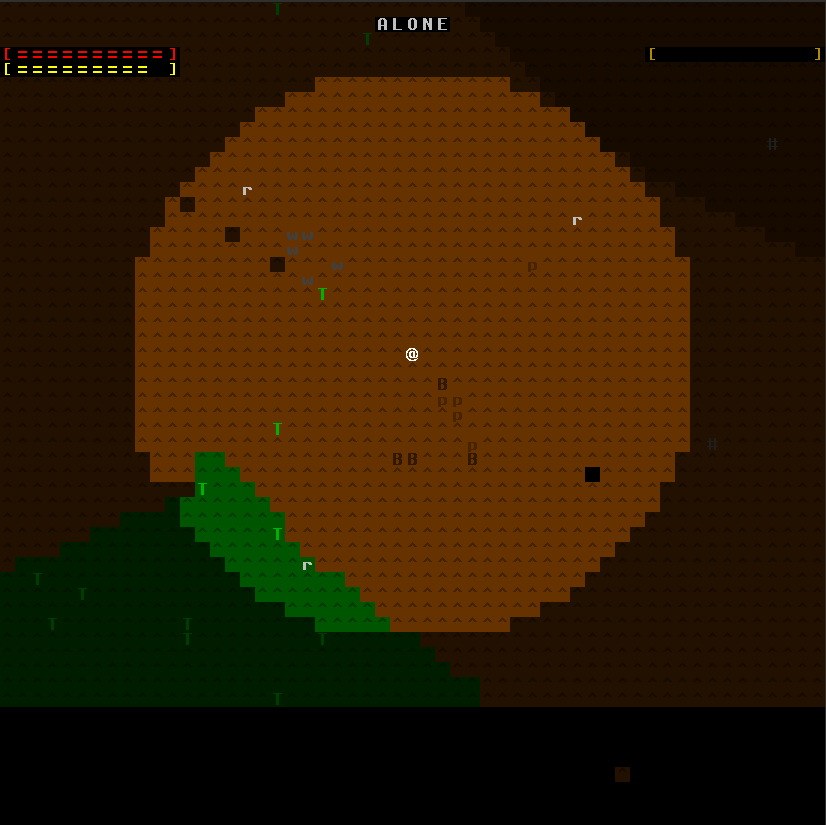
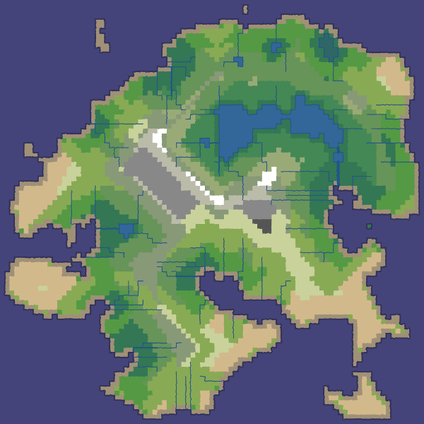
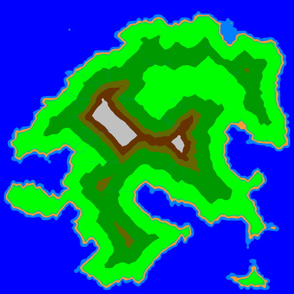

# Alone

Single-player ASCII roguelike/roguelite focused on surviving, alone, on an island inhabited by animals.
The main inspiration is from [Unreal World](http://unrealworld.fi) and [Wayward](http://www.waywardgame.com),
with a much simpler gameplay.

It's a real-time game but it defaults to a turn-based modality where the world only advances during player actions,
for as long as the player action runs. Pure real-time gameplay can be toggled.

**NB: this is not even in alpha state.** Lurk freely if you like the concept, but *know* this is not playable,
by far.
Keep an eye on the [release](https://github.com/fabioticconi/alone-the-roguelite/releases) area, for the future.

## Controls

* **`directional arrows` to move** (hold two together for diagonal movement, eg UP+RIGHT to go north-east)

  Move into creatures to attack them (message/combat log coming soon), trees to cut them, boulders to crush them.
  For the last two you need proper tools (a cutting weapon for cutting three, not craftable yet, and a blunt weapon
  for crushing boulders: you can use a stone for that)
  
* **`g` to get the first item** on the ground you are currently positioned on (stones, sticks, corpses, tree trunks..
  there's no inventory limit for now).
  Type **`d` to drop the oldest item** in your inventory. Inventory screen upcoming..
  
* **`t` to throw** a throwable weapon (only stones, for now - they must be in the inventory).
  The targeting system is just a stub for now: it simply targets the closest creature, tree or boulders in your view.
  Soon there'll be proper targeting.
  
* **`e` to eat** if there's a corpse in the cell you are on or in any of the 8 neighbouring cells. If you got a corpse
  from the ground, you need to drop it before you can eat it. Quantities have to be optimised but generally even a rabbit
  corpse should be enough to empty your hunger bar.
  
There are also some special commands:

* **`Ctrl+SPACE`** to toggle real-time/turn-based behaviour

* **`SPACE`** to pause/unpause if you are on real-time mode; if you are on turn-based mode, keep `SPACE`
  pressed to temporarily run the game in real-time (needed, for example, to recover stamina when you finish it,
  or regenerate health).
  
* **`F1`** removes the speed delay of the player. Useful to test the game without having to suffer the movement delays.
  Will be removed in the final version.
  
* **`F2`** restores the correct player speed.
  Will be removed in the final version.
  
## Screenshots

This is how the game looks when run (**very** preliminary GUI):

A few wolves are chasing rabbits, while pumas manage to bring a buffalo down.

### Original Map

Thanks to the map generator from [Red Blob Games](https://www.redblobgames.com/), I produced the map above. The one in
the game is fundamentally based on this (eg, it uses this heightmap) but it then simplifies the terrains into less
groups - so my map is much less coloured and it has less water mass.

The rivers and lakes are also currently not present. The map is **2048x2048 pixels**, and it's pixel is one "cell" in
game, so it's pretty big.

In game, if it could be zoomed out it would look more like this:

The elevation thresholds are simplified to reduce the amount of colours (and thus, terrains) shown.

Later the terrain will be configurable by the user.

You can also see some rivers (still in-progress, not in the game yet) flowing from high to low places.

## Features

### Field of view

Powered by [`rlforj-alt`](http://github.com/fabioticconi/rlforj-alt), all creatures have their own field of view.
Different species might have shorter or longer sight, but if you hide behind a tree you won't be seen.

Pathfinding is both precise and efficient thanks to an AStar implementation that takes the sight into account
to plan a course to a target position.

What this means for the end user is that the game doesn't cheat. It doesn't magically make creatures see you
if they shouldn't. The other creatures can only do what *you* also can.

### Simple Ecology Simulation

Creatures don't "pop" or "spawn", they don't just appear when needed but they keep going even when the
player is not looking.

This is the main difference between Alone and most roguelikes/roguelites. It makes it a simulation game, to an extent.

Different creatures have different set of behaviours:

* Herbivores flee from Carnivores on sight, and can only feed on grass. They'll seek grass terrain (plain or hill)
  when they see it.
   
* Carnivores will feed on a corpse if they see one, and chase any herbivores on sight unless they are not hungry at all.

* Some types of herbivores are solitary, others live in packs/herds. Same for carnivores. Being far away from the
  other elements of the group might trigger a Flock behaviour, but it's unlikely to take precedence over seeking food
  or fleeing a predator.
  
* Fishes are abundant in the sea, but they are hard to catch. They swim quickly while you'll move slowly in the water.
  However, they might not flee away if you stay still and don't move..

### Survival

The main goal of the game. You need to eat, drink (*not yet*) and keep your health up.

Escape predators, steal their carcasses if you can, or kill any walking thing and eat it.

### Crafting

**Not implemented yet**. It will cover the basic primitive technology of a Neolithic hunter, eg stone knives, spears and axes,
simple bark protection, a shelter, maybe rudimentary pit traps and extraction of parts from dead animals.
