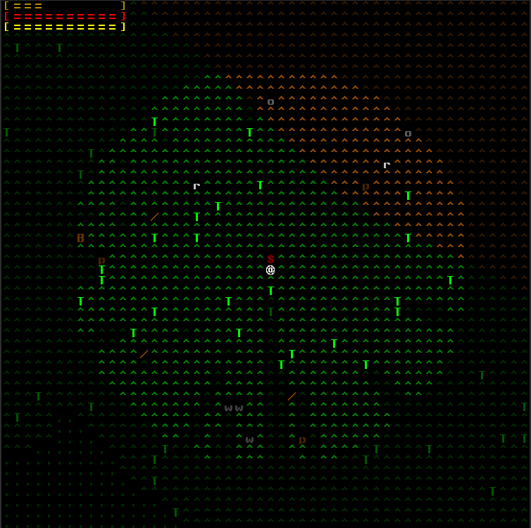
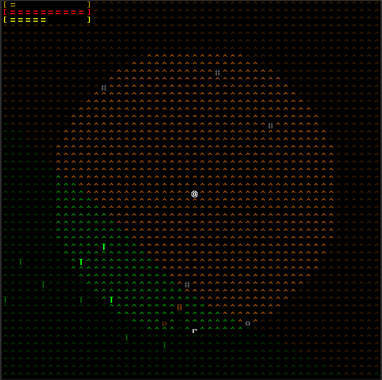

# Alone

Simple single-player ANSI roguelike/roguelite. It's intended as a toy project to learn a bit about single-player game
programming (and also specifically to learn artemis-odb) without the hassle of game physics and most importantly
graphics.

It's a real-time game but it defaults to a turn-based modality where the world only advances during player actions,
for as long as the player action runs. Pure real-time gameplay can be toggled.

**NB: this is not even in alpha state.** Lurk freely if you like the concept, but *know* this is not playable, by far.
Keep an eye on the [releases](https://github.com/fabioticconi/alone-the-roguelite/releases) area, for the future.

# Screenshots

## Grassy Hill

Plenty of trees and animals, some fallen trunks or branches, a corpse in red. Some stones are visible, too (they can be
used as weapons, or thrown).

## High Hill

Higher up there's no proper grass, but it's still not mountain. Trees are sparse, some big boulders are visible (these
are proper obstacles like trees: they block both light and movement). Moving in higher terrain consumes more stamina.

# Features

## Field of view

Thanks to [rlforj](https://github.com/kba/rlforj), we are now using "precise permissive FOV", providing with a nice shadowing/light casting.

Creatures and player alike have, thus, only a limited view of the world and can hide from indiscreet eyes.

Right now, everything that is an obstacle blocks both light and movement, from rabbits to trees. Later some things
will block movement but not light, so that you will be able to see behind most animals (minus the biggest ones).

## Simple Ecology

Creatures don't "pop", they don't appear when needed, but the simulation keeps going even when the player is not looking.
This is the main difference between Alone and most roguelikes/roguelites. It makes it a simulation game, to an extent.

Different creatures have different set of behaviours:

- small, independent **r**abbits are fleeing from a puma
- large **B**isons, pacifically grazing and staying close to the herd, are attacked (and divided! that's unintentional, btw) by wolves
- relatively small **w**olves chase bisons with pack behaviour
- relatively large **P**umas attack their prey (here, rabbits) independently, they are not a pack

The Size of animals determines whether the letter is uppercase or lowercase. This should prove useful to quickly gauge whether to go fight or flight.

## Survival

The main goal of the game. You need to eat, drink and keep your health up. Escape predators, steal their carcasses if
you can, or kill them and eat them.

## Crafting

Not implemented yet. It will cover the basic primitive technology of a Neolithic hunger, eg stone knives, spears and axes,
simple bark protection, a shelter, maybe rudimentary pit traps and extraction of parts from dead animals.
