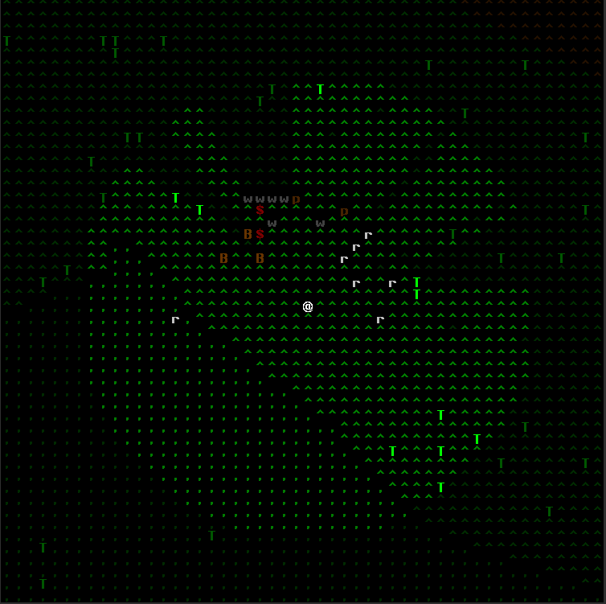

# Alone

Simple single-player ANSI roguelike/roguelite. It's intended as a toy project to learn a bit about single-player game
programming (and also specifically to learn artemis-odb) without the hassle of game physics and most importantly
graphics.

It's a real-time game but it defaults to a turn-based modality where the world only advances during player actions,
for as long as the player action runs. Pure real-time gameplay can be toggled.

**NB: this is not even in alpha state.** Lurk freely if you like the concept, but *know* this is not playable, by far.
Keep an eye on the [releases](https://github.com/fabioticconi/alone-the-roguelite/releases) area, for the future.

# Controls

* Move using the directional arrows (hold two together for diagonal movement, eg UP+RIGHT to go north-east)

* Move into creatures to attack them (message/combat log coming soon), trees to cut them, boulders to crush them.
  For the last two you need proper tools (a cutting weapon for cutting three, not craftable yet, and a blunt weapon
  for crushing boulders: you can use a stone for that)
  
* Type **g** to get the first item on the ground you are currently positioned on (stones, sticks, corpses, tree trunks..
  there's no inventory limit for now).
  Type **d** to drop the oldest item in your inventory. Inventory screen upcoming..
  
* Type **t** to throw a throwable weapon (only stones, for now). The targeting system is just a stub for now: it simply
  targets the closest creature, tree or boulders in your view. Soon there'll be proper targeting.

# Features

## Field of view

Thanks to [rlforj](https://github.com/kba/rlforj), we are now using "precise permissive FOV", providing with a nice shadowing/light casting.

Creatures and player alike have, thus, only a limited view of the world and can hide from indiscreet eyes.

Right now, everything that is an obstacle blocks both light and movement, from rabbits to trees. Later some things
will block movement but not light, so that you will be able to see behind most animals (minus the biggest ones).

## Simple Ecology

Creatures don't "pop" or "spawn", they don't just appear when needed but they keeps going even when the
player is not looking.

This is the main difference between Alone and most roguelikes/roguelites. It makes it a simulation game, to an extent.

Different creatures have different set of behaviours:

* Herbivores flee from Carnivores on sight, and can only feed on grass. They'll seek grass terrain (plain or hill)
  when they see it.
   
* Carnivores will feed on a corpse if they see one, and chase any herbivores on sight unless they are not hungry at all.

* Some types of herbivores are solitary, others live in packs/herds. Same for carnivores. Being far away from the
  other elements of the group might trigger a Flock behaviour, but it's unlikely to take precedence over seeking food
  or fleeing a predator.

## Survival

The main goal of the game. You need to eat, drink and keep your health up. Escape predators, steal their carcasses if
you can, or kill them and eat them.

## Crafting

Not implemented yet. It will cover the basic primitive technology of a Neolithic hunter, eg stone knives, spears and axes,
simple bark protection, a shelter, maybe rudimentary pit traps and extraction of parts from dead animals.

# Screenshots

Plenty of trees and animals on the grassy hill, one fall tree trunk, a corpse in red.
One stone is visible, too (they can be used as weapons, or thrown).

Higher up there's no proper grass, but it's still not mountain. Trees are sparse here, but some big boulders are visible (these
are proper obstacles like trees: they block both light and movement).

Thanks to the map generator from [Red Blob Games](https://www.redblobgames.com/), I produced the map above. The one in
the game is fundamentally based on this (eg, it uses this heightmap) but it then simplifies the terrains into less
groups - so my map is much less coloured and it has less water mass.

The rivers and lakes are also currently not present. The map is 2048x2048 pixels/cells, so it's pretty big.
