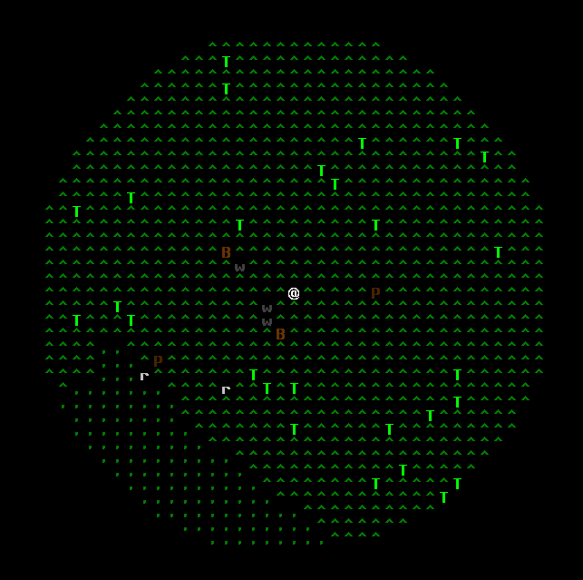

# Alone: the roguelite

Simple single-player ANSI roguelite. It's intended as a toy project to learn a bit about single-player game programming
(and also specifically to learn artemis-odb) without the hassle of game physics and most importantly graphics.

It deviates a bit from the "roguelite canon" already at this early stage: the creatures and objects are permanent.
A basic reproductive ability and genetic modification should allow for an increasingly difficult environment,
adapting to itself and to the player growing in strength.

**NB: this is not even in alpha state.** Lurk freely if you like the concept, but *know* this is not playable, by far. Keep an eye on the [releases](https://github.com/fabioticconi/alone-the-roguelite/releases) area, for the future.

# Features

Not all the following is completely implemented, but you can see as a "core feature". It will be in.

## Field of view

Thanks to [rlforj](https://github.com/kba/rlforj), we are now using "precise permissive FOV", providing with a nice shadowing/light casting.

Creatures and player alike have, thus, only a limited view of the world and can hide from indiscreet eyes.

## Persistence

Creatures don't "pop", they don't appear when needed, but the simulation keeps going even when the player is not looking.

## Small-scale ecology

Different creatures have different set of behaviours. Here we see four animal species:

- small, independent **r**abbits are fleeing from a puma
- large **B**isons, pacifically grazing and staying close to the herd, are attacked (and divided! that's unintentional, btw) by wolves
- relatively small **w**olves chase bisons with pack behaviour
- relatively large **P**umas attack their prey (here, rabbits) independently, they are not a pack

The Size of animals determines whether the letter is uppercase or lowercase. This should prove useful to quickly gauge whether to go fight or flight.

Many of the attributes for the animals are currently configurable in a yaml file, but it's still not enough.
Eventually any creature, flora, item or terrain feature will be completely specifiable via those yaml files.

Trees are present but don't do anything yet.

NOTE: the specific animals are just chosen for now to cover the four different most important combinations:

- Herbivore/Carnivore
- Solitary/Group

The actual "name" may change, I may add more, not sure. But they make for good testing.
